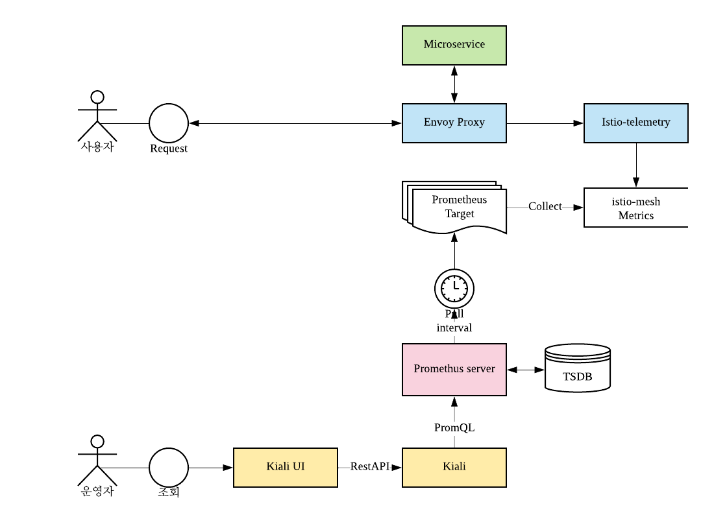

# Visualizing mesh with Kiali
---
*docker engine 18.06.2-ce*, *kubernetes 1.13.4*, *Istio 1.1.1*, *minikube v0.35.0* , *macOS Mojave 10.14.4(18E226)*

Istio에서 수집된 각종 지표를 기반으로, 서비스간의 관계와 처리량, 정상 여부, 응답 시간등 각종 지표들을 를 시각화해주는 Kiali를 minikube 환경에서 설치해보고 실행해봅니다.

* [Istio Task 공식문서](https://istio.io/docs/tasks/telemetry/kiali/)
* [Kiali](https://www.kiali.io/)
* [Kiali 문서](https://www.kiali.io/documentation/overview/)

## 개요
---

### Kiali Project

Kiali는 다음과 같이 2개의 프로젝트로 구성되어 있다.

* https://github.com/kiali/kiali
  * back-end
  * 개발언어 : go
* https://github.com/kiali/kiali-ui
  * font-end
  * 개발언어 : typescript(nodejs)

### Architecture

{:width="600px"}

* Dependency 
  * Cluster API (K8s api server)
  * Istio
  * Prometheus
* Optional
  * Jaeger
  * Grafana

### Trace-data Flow

* 1단계
  * 일반 앱 사용자들이 앱을 사용하는 단계
  * 앱에서 발생하는 request(telemetry)를  envoy proxy 가 샘플링 수집하여 istio-mixer로 전달한다.
* 2단계
  * Prometheus가 istio-mixer로 부터 metrics 를 수집하는 단계
  * Prometheus는 target 에 정의된 istio-mesh metrics를 수집 (pull)한다.
* 3단계
  * 운영자가 trace 정보를 조회하는 단계
  * Kiali UI 의 요청에 따라 Kiali backend는 PromQL을 통해 Prometeus로 부터 metrics 조회하고 그래프 데이터로 가공하여 UI로 전달한다.
  * 수신된  그래프 데이터로 Kiali UI 는 Trace 정보를 시각화 한다.

{:width="600px"}

## Kiali를 minikube 환경에서 설치하고 실행해보기
---

## minikube, Istio 준비

* minikube 준비

~~~
$ minikube start --cpus 4 --memory 8192 -p istio-visual-mesh
~~~

* Helm 설치 및 초기화

~~~
$ brew install kubernetes-helm
$ helm init
~~~

* Istio 초기화 (namespace, CRDs)

~~~
$ wget https://github.com/istio/istio/releases/download/1.1.1/istio-1.1.1-osx.tar.gz
$ tar -vxzf istio-1.1.1-osx.tar.gz
$ cd istio-1.1.1
$ kubectl create namespace istio-system
$ helm template install/kubernetes/helm/istio-init --name istio-init --namespace istio-system | kubectl apply -f -
~~~

## Kiali 설치하기

* Secret 생성 - 사용할 계정(아이디 비밀번호)을 base64 인코딩하고 환경변수에 지정

~~~
$ KIALI_USERNAME=$(echo -n 'admin' | base64)
$ KIALI_PASSPHRASE=$(echo -n 'admin' | base64)
$ kubectl apply -f - <<EOF
apiVersion: v1
kind: Secret
metadata:
  name: kiali
  namespace: istio-system
  labels:
    app: kiali
type: Opaque
data:
  username: $KIALI_USERNAME
  passphrase: $KIALI_PASSPHRASE
EOF
~~~

* `kiali.enabled=true` 옵션을 지정하여 Kiali 포함하도록 Istio 설치

~~~
$ helm template install/kubernetes/helm/istio --name istio --namespace istio-system \
--set kiali.enabled=true \
| kubectl apply -f -
~~~

* Kiali 파드 Running상태 확인 및 대기

~~~
$ kubectl get pod -n istio-system -w
~~~

### Kiali 실행해보기

* [BookInfo](https://istio.io/docs/examples/bookinfo/) 어플 설치 및 확인(대기)

~~~
$ kubectl apply -f <(istioctl kube-inject -f samples/bookinfo/platform/kube/bookinfo.yaml)
$ kubectl get pod  -w
~~~

* 포트 포워드
  * Kiali : 20001
  * 샘플앱 - Bookinfo : 9080

~~~
$ kubectl port-forward -n istio-system svc/kiali 20001:20001
$ kubectl port-forward -n default svc/productpage 9080:9080 
~~~

* 브라우저에서 kiali UI - [http://localhost:20001/kiali/console](http://localhost:20001/kiali/console) 에 접속
* 앞서 등록했던 계정 (admin/admin) 으로 로그인한다.
* 트래픽 발생시키지 않으면 Visualization 한 화면을 확인할 수 없으므로 임의로 트래픽을 발생시킨다.

~~~
$ PROD_URL=http://localhost:9080/productpage; \
for i in {1..10}; do \
  curl -I $PROD_URL; \
  sleep 1; \
done
~~~

* 트래픽 발생하고 잠시 후 브라우저 결과가 반영된다. 좌측 메뉴 `Graph` 메뉴 참조

* Kiali 실행 데모

## 마치며

* Istio 패키지에 Kiali 가 포함되어 있어 Istio 설치시 옵션지정만으로 간편하게 Kiali를 같이 설치하고 서비스 할 수 있었다.
* 복잡한 Microservice 아키텍처 환경에서 구성된 앱간의 트래픽 정보를 보기 쉽게 시각화하는 Kiali의 Graph는 활용 가치가 충분해 보였다.
* zipkin 등과의 연동을  통해 distributed trace 정보를 제공하며 그래프 상의 트래픽 데이터는 Prometheus를 데이터소스로 활용하고 있다.

## 참고

* Istio Kiali와 zipkin(jaeger) 와 같이 설치하는 경우
  * `pilot.traceSampling=10` : Temlemetry 중 10%를 샘플링
~~~
$ helm template install/kubernetes/helm/istio --name istio --namespace istio-system \
--set kiali.enabled=true \
--set tracing.enabled=true \
--set tracing.provider=zipkin \
--set tracing.ingress.enabled=true \
--set pilot.traceSampling=10 \
| kubectl apply -f -
~~~

* 신규 Prometheus를 설치하지 않고 외부 Prometheus를 지정
  * `prometheus.enabled=false` :  Prometheus 설치 제외
  * `prometheusAddr` : 외부 Prometheus 주소

~~~
$ helm template install/kubernetes/helm/istio --name istio --namespace istio-system \
--set prometheus.enabled=false \
--set prometheusAddr=http://prometheus.default.svc.cluster.local:80 \
| kubectl apply -f -
~~~
