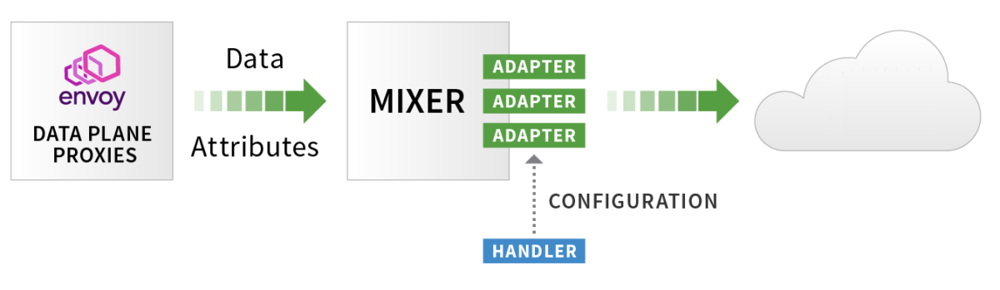

# Istio telemetry - collect  metrics & logs on minikube
---
*kubernetes 1.14.0*, *Istio 1.1.1*, *minikube v1.0.0* , *macOS Mojave 10.14.4(18E226)*

Istio에서 telemetry metric, 수집하는 handler,  metric 과 handler를 연결하는 rule 정의를 통하여 telemetry 데이터를 수집하고 grafana를 통해 그 결과를 조회해 봅니다.

## 준비작업
***

* minikube 준비

~~~
$ minikube start --cpus 4 --memory 8192 -p istio-telemetry
~~~

* Helm 설치 및 초기화

~~~
$ brew install kubernetes-helm
$ helm init
~~~

* Istio 초기화 (namespace, CRDs)

~~~
$ wget https://github.com/istio/istio/releases/download/1.1.1/istio-1.1.1-osx.tar.gz
$ tar -vxzf istio-1.1.1-osx.tar.gz
$ cd istio-1.1.1
$ kubectl create namespace istio-system
$ helm template install/kubernetes/helm/istio-init --name istio-init --namespace istio-system | kubectl apply -f -
~~~

* Istio 설치

~~~
$ helm template install/kubernetes/helm/istio --name istio --namespace istio-system \
| kubectl apply -f -
~~~

* Istio 파드 정상상태 확인 

~~~
$ kubectl get pod -n istio-system
~~~

* Istio-system 파드 정상상태로 구성되었다면  [BookInfo](https://istio.io/docs/examples/bookinfo/) 어플 설치 및 확인

~~~
$ kubectl apply -f <(istioctl kube-inject -f samples/bookinfo/platform/kube/bookinfo.yaml)
$ kubectl get pod
~~~

* _Istio ingress gateway_  환경변수 `GW_URL` 정의

~~~
$ export GW_URL=http://$(minikube ip -p istio-trace):$(kubectl -n istio-system get service istio-ingressgateway -o jsonpath='{.spec.ports[?(@.name=="http2")].nodePort}')
~~~

## Metrics
***

### Collect Matrics
이 TASK는  Metrics 를 커스트마이징하고 수집하기위해 Istion 구성을 어떻게 하는지를 보여준다. 

* Monitoring Microservices with Istio
  * 마이크로서비스간 트래픽에 따른 Envoy Sidecar가 Proxy를 통해 얻은 데이터 속성들을 Mixer가 Telemetry-backend(Prometheus, Fluentd 등) 로 전달
     
    * 출처: [Monitoring Microservices with Istio](https://www.signalfx.com/blog/monitoring-microservices-with-istio/)

  * Matric(Instance), Handler, Rule 정의를 통한 Istio Collect Metrics 구조
    
    * 출처: [Monitoring Microservices with Istio](https://www.signalfx.com/blog/monitoring-microservices-with-istio/)

* Mixer가 Mesh내 모든 트래픽에 대한 레포트와 메트릭을 자동으로 생성하도록  구성
* 3가지 Mixer의 기능을 컨트롤하도록 구성을 추가한다.
  1. kind : metric - Istion 속성으로부터 _instance_ 구성
  1. kind : prometheus - 생성된 _instance_를 처리할 수 있는 Prometheus _handler_ 구성
  1. kind : rule - _instance_ 를 Prometheus _handler_ 에게  보내는 규칙 지정

~~~
$ kubectl apply -f - <<EOF
apiVersion: "config.istio.io/v1alpha2"
kind: metric
metadata:
  name: doublerequestcount
  namespace: istio-system
spec:
  value: "2" # count each request twice
  dimensions:
    reporter: conditional((context.reporter.kind | "inbound") == "outbound", "client", "server")
    source: source.workload.name | "unknown"
    destination: destination.workload.name | "unknown"
    message: '"twice the fun!"'
  monitored_resource_type: '"UNSPECIFIED"'
---
apiVersion: "config.istio.io/v1alpha2"
kind: prometheus
metadata:
  name: doublehandler
  namespace: istio-system
spec:
  metrics:
  - name: double_request_count # Prometheus metric name
    instance_name: doublerequestcount.metric.istio-system # Mixer instance name (fully-qualified)
    kind: COUNTER
    label_names:
    - reporter
    - source
    - destination
    - message
---
apiVersion: "config.istio.io/v1alpha2"
kind: rule
metadata:
  name: doubleprom
  namespace: istio-system
spec:
  actions:
  - handler: doublehandler.prometheus
    instances:
    - doublerequestcount.metric
EOF
~~~

* Metrics가 정상 수집되는지 확인을 위해 BookInfo 서비스로 트래픽 발생시킨다.

~~~
$ curl -I $GW_URL/productpage
~~~

* Prometheus 포트 포워딩

~~~
$ kubectl -n istio-system port-forward $(kubectl -n istio-system get pod -l app=prometheus -o jsonpath='{.items[0].metadata.name}') 9090:9090
~~~

* 결과 확인
  * 브라우저에서 [_http://localhost:9090_](http://localhost:9090) 을 열고  입력박스에 `istio_double_request_count` 를 입력하고 "Execute"  버튼 클릭한다.
  * /productpage 페이지가 호출될 때마다 카운트가 2개씩 증가함을 확인한다.

### Prometheus로 부터 Metrics 조회 
이 TASK는 Prometheus를 활용하여 Istio Metrics 를 어떻게 조회하는를 보여준다.

* Promethus URL 에서 Query에 아래 항목을 입력하고 "Execute"  버튼 클릭
  * `istio_requests_total` : request 전체 
  * `istio_requests_total{destination_service="productpage.default.svc.cluster.local"}` : productpages 요청수
  * `istio_requests_total{destination_service="reviews.default.svc.cluster.local", destination_version="v3"}` :  reviews 의 v3 요청 수
  * `rate(istio_requests_total{destination_service=~"productpage.*", response_code="200"}[5m])` : 모든 productpage 서비스 5분마다 요청 비율productpage service 

### Visualizing Metrics with Grafana
이 TASK는 서비스 메시내의 트래픽 모니터링을 위해 Grafana Dashboard 를 어떻게 구성하고 사용하는지를 보여준다.

* grafana 사용 옵션 추가하여  istio 재구성

~~~
$ helm template install/kubernetes/helm/istio --name istio --namespace istio-system \
--set grafana.enabled=true \
| kubectl apply -f -
~~~

* Istio 파드 정상상태 및 grafana 가 구성되었는지 확인

~~~
$ kubectl get pod -n istio-system
~~~

* productpage 트래픽 발생한다

~~~
$ curl -I $GW_URL/productpage
~~~

* Grafana 포트 포워딩

~~~
$ kubectl -n istio-system port-forward $(kubectl -n istio-system get pod -l app=grafana -o jsonpath='{.items[0].metadata.name}') 3000:3000
~~~

* 결과확인
  * 브라우저에서 [_http://localhost:3000/dashboard/db/istio-mesh-dashboard_](http://localhost:3000/dashboard/db/istio-mesh-dashboard) 을 연다.
  * 트래픽 발생하면 잠시 후 Grafana Dashboard 에 반영되는 것을 확인
  * Istio Dashboard : Mesh, Mixer, Service, Performance, Pilot, Service, Workload, Gally  

## Logs
***

### 로그 수집
이 TASK는  로그를 커스트마이징하고 수집하기위해 Istion 구성을 어떻게 하는지를 보여준다. 

* 메시내 모든 트래픽에 대해서 로그 스트림이 자동으로 생성되고 수집되도록 설정한다.

  1. kind: logentry : Istio 속성들로부터 _instances_ 구성  
  1. kind: stdio : 구성된 _instances_ 처리 _handlers_  생성
  1. kind: rule : _handlers_ 에게 _instances_를 보내는 규칙(매칭조건) 지정

* `configDefaultNamespace=istio-system` 옵션 지정하여 Istio 재구성

~~~
$ helm template install/kubernetes/helm/istio --name istio --namespace istio-system \
--set configDefaultNamespace=istio-system \
| kubectl apply -f -
~~~

~~~
$ kubectl apply -f - <<EOF
apiVersion: "config.istio.io/v1alpha2"
kind: logentry
metadata:
  name: newlog
  namespace: istio-system
spec:
  severity: '"warning"'
  timestamp: request.time
  variables:
    source: source.labels["app"] | source.workload.name | "unknown"
    user: source.user | "unknown"
    destination: destination.labels["app"] | destination.workload.name | "unknown"
    responseCode: response.code | 0
    responseSize: response.size | 0
    latency: response.duration | "0ms"
  monitored_resource_type: '"UNSPECIFIED"'
---
apiVersion: "config.istio.io/v1alpha2"
kind: stdio
metadata:
  name: newhandler
  namespace: istio-system
spec:
 severity_levels:
   warning: 1 # Params.Level.WARNING
 outputAsJson: true
---
apiVersion: "config.istio.io/v1alpha2"
kind: rule
metadata:
  name: newlogstdio
  namespace: istio-system
spec:
  match: "true" # match for all requests
  actions:
   - handler: newhandler.stdio
     instances:
     - newlog.logentry
EOF
~~~

* /productpage 트래픽 발생

~~~
$ curl -I $GW_URL/productpage
~~~

* istio-telemetry 파드 로그 검색하여 3개 로그가 조회됨을 확인

~~~
$ kubectl logs -n istio-system -l istio-mixer-type=telemetry -c mixer \
| grep \"instance\":\"newlog.logentry.istio-system\" \
| grep -v '"destination":"telemetry"' \
| grep -v '"destination":"pilot"' \
| grep -v '"destination":"policy"' \
| grep -v '"destination":"unknown"'
~~~

*  logentry의 variables 반경하고  destination service 이름이 "details"만 로깅 되도록 rule 을 변경 

~~~
$ kubectl apply -f - <<EOF
apiVersion: "config.istio.io/v1alpha2"
kind: logentry
metadata:
  name: newlog
  namespace: istio-system
spec:
  severity: '"warning"'
  timestamp: request.time
  variables:
    service: destination.service.name | "unknown"
    latency: response.duration | "0ms"
  monitored_resource_type: '"UNSPECIFIED"'
---
apiVersion: "config.istio.io/v1alpha2"
kind: rule
metadata:
  name: newlogstdio
  namespace: istio-system
spec:
  match: destination.service.name=="details"
  actions:
   - handler: newhandler.stdio
     instances:
     - newlog.logentry
EOF
~~~

* /productpage 트래픽 발생

~~~
$ curl -I $GW_URL/productpage
~~~

* istio-telemetry 파드 로그 검색하여 줄어든 속성으로 로그가 3개가 아닌 2개(app=details)만  조회됨을 확인

~~~
$ kubectl logs -n istio-system -l istio-mixer-type=telemetry -c mixer \
| grep \"instance\":\"newlog.logentry.istio-system\" \
| grep -v '"destination":"telemetry"' \
| grep -v '"destination":"pilot"' \
| grep -v '"destination":"policy"' \
| grep -v '"destination":"unknown"'
~~~

### Getting Envoy's Access Logs
이 TASK는 Envoy 의 엑세스로그를  standard output 출력을 어떻게 구성하는지 보여준다.

* _sleep_,  _httpbin_ 샘플 설치 및 실행여부 확인

~~~
$ kubectl apply -f <(istioctl kube-inject -f samples/sleep/sleep.yaml)
$ kubectl apply -f <(istioctl kube-inject -f samples/httpbin/httpbin.yaml)
$ kubectl get pod
~~~

* `global.proxy.accessLogFile` 옵션 추가하여  istio 재구성

~~~
$ helm template install/kubernetes/helm/istio --name istio --namespace istio-system \
--set configDefaultNamespace=istio-system \
--set global.proxy.accessLogFile="/dev/stdout"  \
| kubectl apply -f -
~~~

* _sleep_ 에서 _httpbin_ 로 요청 "teapot" 결과 나오는지 확인

~~~
$ kubectl exec -it $(kubectl get pod -l app=sleep -o jsonpath={.items..metadata.name}) -c sleep -- curl -v httpbin:8000/status/418
~~~

* _sleep_ 과 _httpbin_ 로그 마지막 줄에 "GET /status/418 HTTP/1.1" 418 " 조회되는지 확인

~~~
$ kubectl logs -l app=sleep -c istio-proxy -f
$ kubectl logs -l app=httpbin -c istio-proxy -f
~~~

* 비교를 위해 `global.proxy.accessLogFile` 옵션에 공백값을 주어  istio 재구성

~~~
$ helm template install/kubernetes/helm/istio --name istio --namespace istio-system \
--set configDefaultNamespace=istio-system \
--set global.proxy.accessLogFile=""  \
| kubectl apply -f -
~~~

* _sleep_ 에서 _httpbin_ 로 요청 "teapot" 결과 나오는지 확인하고 각각의 로그에서 Access 로그가 추가되지 않았음을 확인

~~~
$ kubectl exec -it $(kubectl get pod -l app=sleep -o jsonpath={.items..metadata.name}) -c sleep -- curl -v httpbin:8000/status/418
~~~
